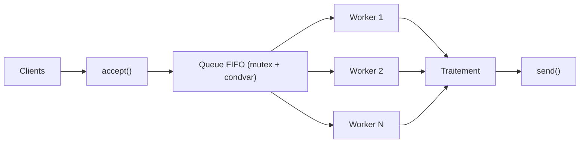
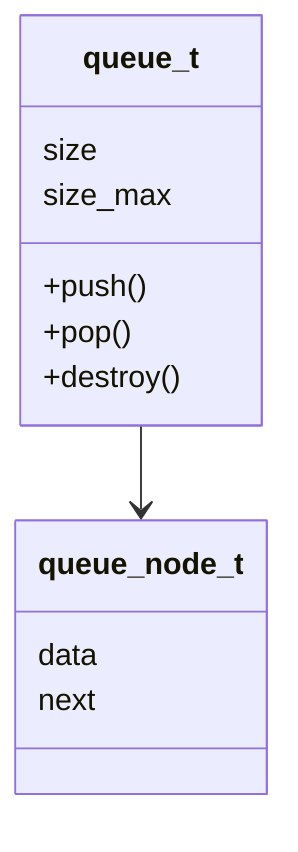
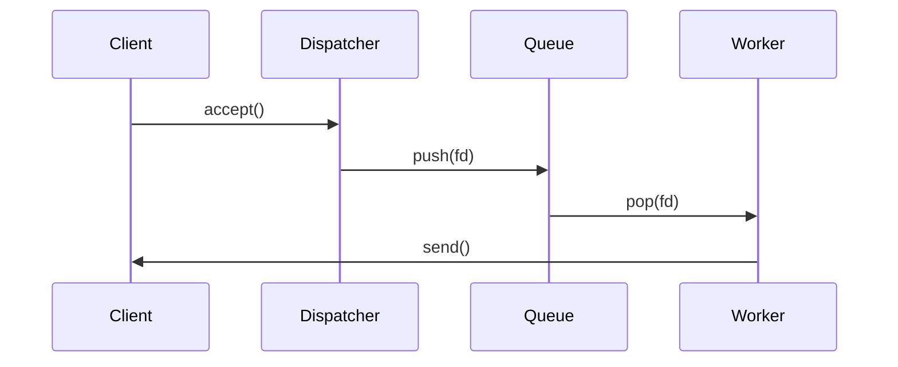
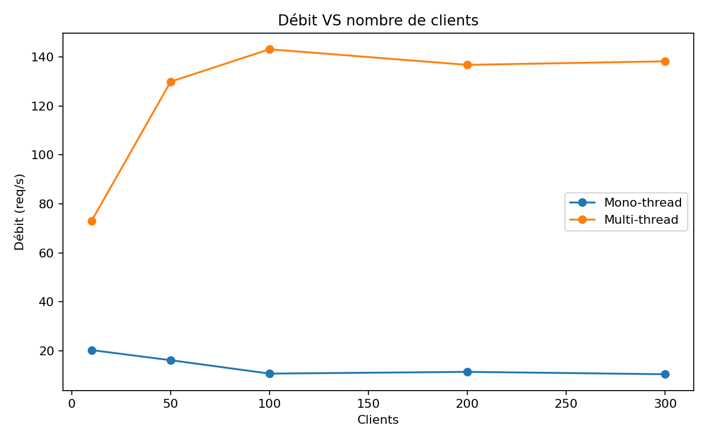
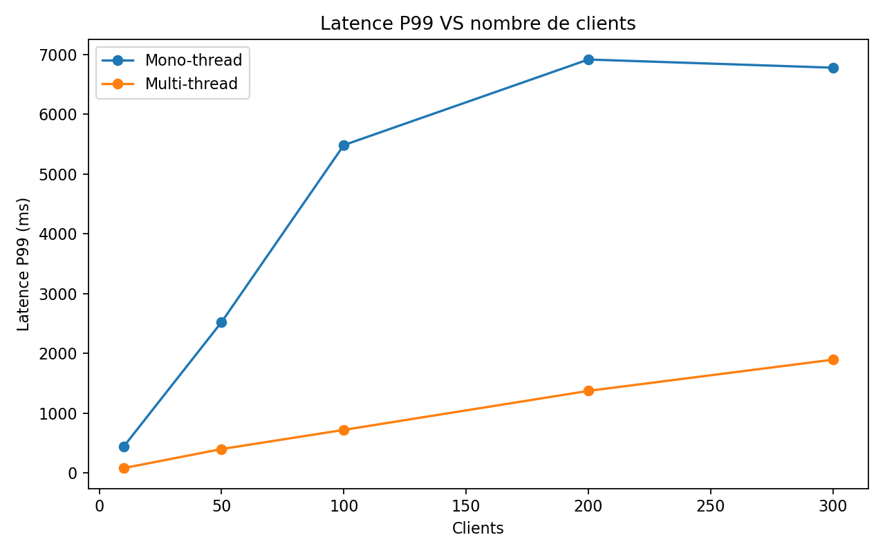
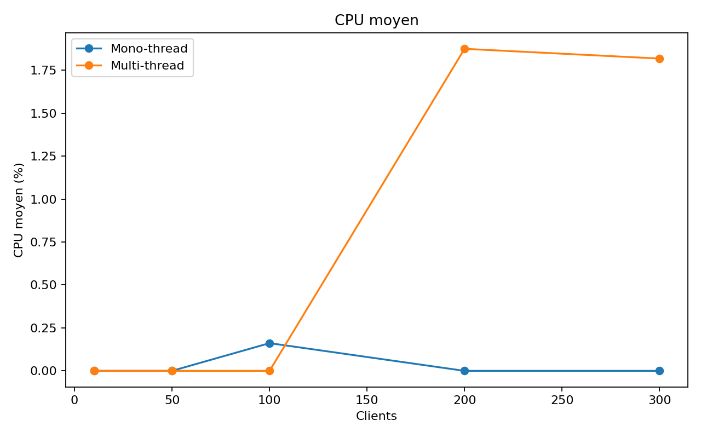
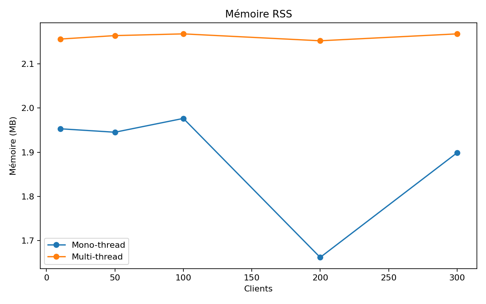

# 🚀 Serveur TCP & HTTP Hautes Performances — C/POSIX

## ⚡ Extreme Edition — Multi-threading · Queue FIFO · Benchmarks · UML · Mermaid · CI/CD

---

<p align="center">
  
  
  
  
  
</p>

---

## 🔧 Badges GitHub Actions (CI/CD)

| Workflow        | Status |
|-----------------|--------|
| Build & Tests   |  |
| Cppcheck        |  |
| CodeQL          |  |
| Benchmarks      |  |
| Deploy Docs     |  |


🔥 **Throughput actuel :**


**Documentation en ligne** → <https://walidbentouhami.github.io/SERVER_BENCH/>

---

## 📚 Table des matières

* [🎥 GIF Démonstrations](#gif-démonstrations)
* [📦 Projet — Version FR/EN](#projet-version-fren)
* [🧠 Mermaid Diagrams](#mermaid-diagrams)
* [📊 Benchmarks](#benchmarks)
* [🛠 Installation](#installation)
* [⚙ Exécution](#exécution)
* [🧪 Tests & Validation](#tests-validation)
* [🚀 Optimisations Appliquées](#optimisations-appliquées)
* [📡 API HTTP](#api-http)
* [📂 Architecture du projet](#architecture-du-projet)
* [🚀 Pipeline DevOps complet](#pipeline-devops-complet)
* [👤 Auteurs](#auteurs)
* [📜 Licence](#licence)

---

## 🎥 GIF Démonstrations

### Serveur TCP Multi-thread

<!--  -->
_GIF demonstration will be added soon._

### Stress Test & Benchmarks

<!--  -->
_GIF demonstration will be added soon._

---

## 📦 Projet — Version FR/EN

## 🇫🇷 Version Française

Ce projet implémente **4 serveurs haute performance** :

| Serveur              | Protocole | Architecture        |
| -------------------- | --------- | ------------------- |
| `serveur_mono`       | TCP       | Mono-thread         |
| `serveur_multi`      | TCP       | Multi-thread + FIFO |
| `serveur_mono_http`  | HTTP 1.1  | Mono-thread         |
| `serveur_multi_http` | HTTP 1.1  | Multi-thread + FIFO |

Fonctionnalités incluses :

✔ Multi-threading (pthread)
✔ Queue FIFO thread-safe
✔ HTTP router minimal
✔ Benchmarks Python (latence, throughput, CPU, mémoire)
✔ UML + Mermaid
✔ CI/CD GitHub complet
✔ Pipeline DevOps automatique
✔ PPTX & PDF auto-générés

---

## 🇬🇧 English Summary

This project provides **4 high-performance network servers** using POSIX sockets:

✔ Multi-thread worker pool
✔ Thread-safe FIFO queue
✔ Minimal HTTP 1.1 router
✔ Python benchmark suite
✔ Full DevOps automation

---

## 🧠 Mermaid Diagrams

### Architecture Globale



### Queue FIFO



### Dispatcher & Workers



---

## 📊 Benchmarks

### Throughput



### Latence P99



### CPU



### Memory



---

## 🛠 Installation

```bash
sudo apt install build-essential python3 python3-venv python3-pip
git clone https://github.com/WalidBenTouhami/SERVER_BENCH.git
cd SERVER_BENCH
make -j$(nproc)
```

---

## ⚙ Exécution

```bash
make run_mono
make run_multi
make run_mono_http
make run_multi_http
```

---

## 🧪 Tests & Validation

```bash
make test                                        # Run unit tests
make MODE=debug all                              # Build with sanitizers
valgrind --leak-check=full ./bin/serveur_multi  # Memory leak check
valgrind --tool=helgrind ./bin/serveur_multi    # Thread safety check
```

## 🚀 Optimisations Appliquées

Le projet utilise des optimisations avancées pour des performances maximales :

### Compilation
- `-O3 -march=native` : Optimisations agressives pour l'architecture cible
- `-flto` : Link-Time Optimization pour optimisations inter-modules
- `-ffast-math` : Optimisations mathématiques rapides
- `-funroll-loops` : Déroulement de boucles pour réduire les branchements
- `-DNDEBUG` : Désactive les assertions pour réduire le overhead

### Sécurité et Robustesse
- Signal handling : `SIGPIPE` ignoré pour gérer les connexions fermées
- `MSG_NOSIGNAL` : Évite les crashes sur envoi vers socket fermé
- Mutex avec `PTHREAD_MUTEX_ERRORCHECK` : Détection d'erreurs de verrouillage
- Format security : `-Wformat=2 -Wformat-security` pour prévenir les vulnérabilités

### Linker
- `-Wl,-O1` : Optimisations au niveau du linker
- `-Wl,--as-needed` : Réduit les dépendances inutiles

---

## 📡 API HTTP

| Route    | Description  |
| -------- | ------------ |
| `/`      | Accueil      |
| `/hello` | JSON         |
| `/time`  | Timestamp    |
| `/stats` | Statistiques |

Example:

```json
{
  "msg": "Hello from HTTP server",
  "requests": 128,
  "worker": 3
}
```

---

## 📂 Architecture du projet

```
src/
├── http.c / http.h
├── queue.c / queue.h
├── serveur_mono.c
├── serveur_multi.c
├── serveur_mono_http.c
└── serveur_multi_http.c
```

---

## 🚀 Pipeline DevOps complet

### Exécution globale

```bash
./scripts/run_interactive.sh
```

Il exécute automatiquement :

✔ Génération HTTP
✔ Build C (O3 + LTO)
✔ Génération UML
✔ Génération PPTX + PDF
✔ Démarrage serveurs
✔ Tests `/`, `/hello`, `/time`, `/stats`
✔ Stress tests TCP/HTTP
✔ Benchmarks extrêmes
✔ Monitoring CPU/RAM
✔ Kill propre multi-thread

---

## 👤 Auteurs

| Auteur                 | Rôle                                | Expertise                |
| ---------------------- | ----------------------------------- | ------------------------ |
| **Walid Ben Touhami**  | DevOps, Multi-threading, Benchmarks | High-performance systems |
| **Yassin Ben Aoun**    | HTTP parser                         | Protocol engineering     |
| **Ghada Sakouhi**      | FIFO queue, UML                     | Software architecture    |
| **Islem Ben Chaabene** | TCP mono-thread                     | POSIX networking         |

---

## 📜 Licence

```
MIT License — Academic Use Only
```
