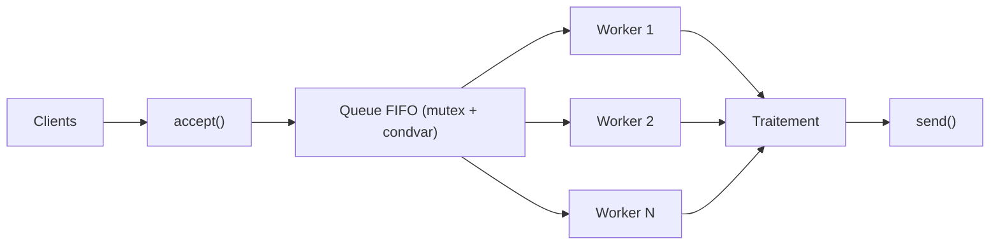
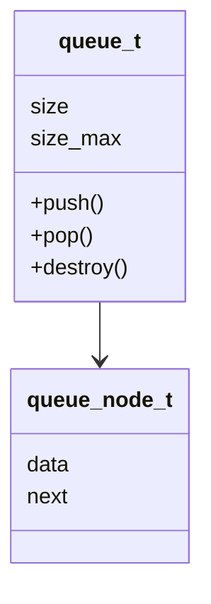
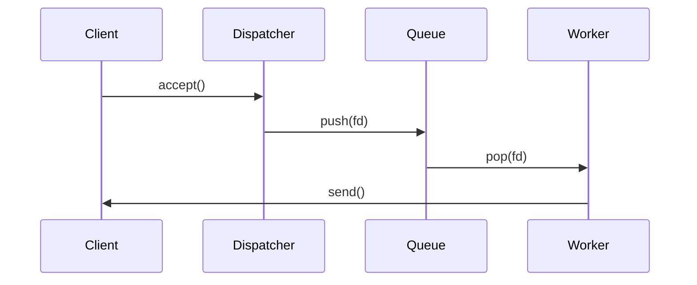

# 🚀 Serveur TCP & HTTP Hautes Performances — C/POSIX

## ⚡ Extreme Edition — Multi-threading · Queue FIFO · Benchmarks · UML · Mermaid · CI/CD

---

<p align="center">
  
  
  
  
  
</p>

---

## 🔧 Badges GitHub Actions (CI/CD)

| Workflow        | Status |
|-----------------|--------|
| Build & Tests   |  |
| Cppcheck        |  |
| CodeQL          |  |
| Benchmarks      |  |
| Deploy Docs     |  |

**Thread-Safe Proven**
[](https://github.com/WalidBenTouhami/SERVER_BENCH)
[-brightgreen?style=flat-square&logo=c)](https://github.com/WalidBenTouhami/SERVER_BENCH)
[](https://github.com/WalidBenTouhami/SERVER_BENCH)
[](https://walidbentouhami.github.io/SERVER_BENCH/)

### 📊 Résultats en Temps Réel

🔥 **Throughput actuel :**  
  
*(Graphique statique ; généré via benchmarks Python – voir figures/ pour live updates)*

**Documentation en ligne** → <https://walidbentouhami.github.io/SERVER_BENCH/>  
*(Dashboard interactif avec résultats, graphiques et comparaison mono/multi)*

---

## 📚 Table des matières

1. [🎥 GIF Démonstrations](#gif-démonstrations)
2. [📦 Projet — Version FR/EN](#projet--version-fren)
3. [🧠 Mermaid Diagrams](#mermaid-diagrams)
4. [📊 Résultats Benchmarks](#résultats-benchmarks)
5. [🛠 Installation & Setup](#installation--setup)
6. [🏗️ Build & Compilation](#build--compilation)
7. [🚀 Démarrage des Serveurs](#démarrage-des-serveurs)
8. [🧪 Tests & Validation](#tests--validation)
   - [Smoke Tests](#smoke-tests)
   - [Stress Tests](#stress-tests)
   - [Validation Tests](#validation-tests)
9. [📈 Benchmarks & KPI](#benchmarks--kpi)
   - [Benchmarks Standards](#benchmarks-standards)
   - [Benchmarks Extrêmes](#benchmarks-extrêmes)
   - [KPI de Performance](#kpi-de-performance)
10. [📊 Visualisation des Résultats](#visualisation-des-résultats)
11. [🧹 Nettoyage du Projet](#nettoyage-du-projet)
12. [🛑 Arrêt des Serveurs](#arrêt-des-serveurs)
13. [🤖 Scripts Disponibles](#scripts-disponibles)
14. [⚙️ Workflows Automatiques](#workflows-automatiques)
15. [🚀 Optimisations Appliquées](#optimisations-appliquées)
16. [📡 API HTTP](#api-http)
17. [📂 Architecture du Projet](#architecture-du-projet)
18. [🚀 Pipeline DevOps Complet](#pipeline-devops-complet)
19. [👤 Auteurs](#auteurs)
20. [📜 Licence](#licence)

---

## 🎥 GIF Démonstrations

### Serveur TCP Multi-thread

<!--  -->
_GIF demonstration will be added soon._

### Stress Test & Benchmarks

<!--  -->
_GIF demonstration will be added soon._

---

## 📦 Projet — Version FR/EN

### 🇫🇷 Version Française

Ce projet implémente **4 serveurs haute performance** :

| Serveur              | Protocole | Architecture        |
| -------------------- | --------- | ------------------- |
| `serveur_mono`       | TCP       | Mono-thread         |
| `serveur_multi`      | TCP       | Multi-thread + FIFO |
| `serveur_mono_http`  | HTTP 1.1  | Mono-thread         |
| `serveur_multi_http` | HTTP 1.1  | Multi-thread + FIFO |

Fonctionnalités incluses :

✔ Multi-threading (pthread)

✔ Queue FIFO thread-safe

✔ HTTP router minimal

✔ Benchmarks Python (latence, throughput, CPU, mémoire)

✔ UML + Mermaid

✔ CI/CD GitHub complet

✔ Pipeline DevOps automatique

✔ PPTX & PDF auto-générés

### 🇬🇧 English Summary

This project provides **4 high-performance network servers** using POSIX sockets:

✔ Multi-thread worker pool

✔ Thread-safe FIFO queue

✔ Minimal HTTP 1.1 router

✔ Python benchmark suite

✔ Full DevOps automation

---

## 🧠 Mermaid Diagrams

### Architecture Globale



### Queue FIFO



### Dispatcher & Workers



---

## 📊 Résultats Benchmarks

### Throughput


### Latence P99


### CPU


### Memory


---

## 🛠 Installation & Setup

### Prérequis Système

```bash
# Ubuntu/Debian
sudo apt install -y build-essential python3 python3-venv python3-pip make git curl netcat-openbsd

# Fedora/RHEL
sudo dnf install -y gcc make python3 python3-pip git curl nmap-ncat
```

### Installation Complète

```bash
# 1. Cloner le dépôt
git clone https://github.com/WalidBenTouhami/server_bench.git
cd server_bench

# 2. Lancer le script d'installation automatique
./setup.sh
```

Le script `setup.sh` effectue automatiquement :
- ✅ Vérification des dépendances système
- ✅ Création de l'environnement virtuel Python (venv)
- ✅ Installation des dépendances Python (pandas, matplotlib, psutil, etc.)
- ✅ Génération des fichiers HTTP
- ✅ Compilation optimisée du projet C

### Installation Manuelle (si nécessaire)

```bash
# Activer l'environnement virtuel
source venv/bin/activate

# Installer les dépendances Python
pip install -r python/requirements.txt

# Compilation C
make clean
make -j$(nproc)
```

---

## 🏗️ Build & Compilation

### Build Standard (Release)

```bash
# Nettoyage complet
make clean

# Compilation optimisée (Release mode avec -O3, -flto, -march=native)
make -j$(nproc)
```

### Build Debug (avec sanitizers)

```bash
# Mode debug avec AddressSanitizer et UndefinedBehaviorSanitizer
make MODE=debug all
```

### Cibles Makefile Disponibles

| Commande | Description |
|----------|-------------|
| `make all` | Build complet (4 serveurs + tests) |
| `make clean` | Nettoyage des binaires et objets |
| `make test` | Compilation et exécution des tests unitaires |
| `make release` | Build release avec optimisations maximales |
| `make debug` | Build debug avec sanitizers |
| `make uml` | Génération des diagrammes UML |

### Modes de Compilation

**Mode Release (par défaut)** :
- Optimisations : `-O3 -march=native -flto -ffast-math -funroll-loops`
- Sécurité : `-fstack-protector-strong -Wformat-security`
- Idéal pour : Production, benchmarks

**Mode Debug** :
- Debugging : `-g -O0 -DDEBUG`
- Sanitizers : `-fsanitize=address,undefined`
- Idéal pour : Développement, détection de bugs

---

## 🚀 Démarrage des Serveurs

### Démarrage Individuel

```bash
# Serveur TCP mono-thread (port 5050)
make run_mono
# OU
./bin/serveur_mono

# Serveur TCP multi-thread (port 5051)
make run_multi
# OU
./bin/serveur_multi

# Serveur HTTP mono-thread (port 8080)
make run_mono_http
# OU
./bin/serveur_mono_http

# Serveur HTTP multi-thread (port 8081)
make run_multi_http
# OU
./bin/serveur_multi_http
```

### Démarrage Automatique (tous les serveurs)

```bash
# Option 1 : Script optimisé (démarrage + monitoring)
./scripts/start_all.sh

# Option 2 : Pipeline complet (build + démarrage + benchmarks)
./scripts/run_all.sh

# Option 3 : Mode interactif (menu)
./scripts/run_interactive.sh
```

### Vérification du Statut

```bash
# Vérifier les processus serveurs
ps aux | grep serveur_

# Vérifier les ports en écoute
ss -ltnp | grep -E ":(5050|5051|8080|8081)"

# OU avec netstat
netstat -tlnp | grep -E ":(5050|5051|8080|8081)"
```

---

## 🧪 Tests & Validation

### Smoke Tests

Les smoke tests permettent de vérifier le bon fonctionnement basique des serveurs.

#### Smoke Tests TCP

**TCP Mono-thread (port 5050)**

```bash
# Terminal 1 : Démarrer le serveur
./bin/serveur_mono

# Terminal 2 : Tests de base
ss -ltnp | grep 5050
python3 python/client_stress_tcp.py --port 5050 --clients 1 --duration 2
```

**TCP Multi-thread (port 5051)**

```bash
# Terminal 1 : Démarrer le serveur
./bin/serveur_multi

# Terminal 2 : Tests de base
ss -ltnp | grep 5051
python3 python/client_stress_tcp.py --port 5051 --clients 1 --duration 2
```

#### Smoke Tests HTTP

**HTTP Mono-thread (port 8080)**

```bash
# Terminal 1 : Démarrer le serveur
./bin/serveur_mono_http

# Terminal 2 : Tests des routes
curl -v http://127.0.0.1:8080/
curl -v http://127.0.0.1:8080/hello
curl -v http://127.0.0.1:8080/time
curl -v http://127.0.0.1:8080/stats
```

**HTTP Multi-thread (port 8081)**

```bash
# Terminal 1 : Démarrer le serveur
./bin/serveur_multi_http

# Terminal 2 : Tests des routes
curl -v http://127.0.0.1:8081/
curl -v http://127.0.0.1:8081/hello
curl -v http://127.0.0.1:8081/time
curl -v http://127.0.0.1:8081/stats
```

### Stress Tests

Les stress tests permettent de mesurer les performances sous charge.

#### Stress Tests TCP

```bash
# Test TCP mono-thread avec rampe de charge
python3 python/client_stress_tcp.py --port 5050 --clients 10,50,100,200

# Test TCP multi-thread avec rampe de charge
python3 python/client_stress_tcp.py --port 5051 --clients 10,50,100,200

# OU via Makefile
make stress_tcp_mono
make stress_tcp_multi
```

#### Stress Tests HTTP

```bash
# Test HTTP mono-thread
python3 python/client_stress_http.py --port 8080 --path /hello --clients 100

# Test HTTP multi-thread
python3 python/client_stress_http.py --port 8081 --path /hello --clients 100

# OU via Makefile
make stress_http_mono
make stress_http_multi
```

### Validation Tests

#### Tests Unitaires

```bash
# Compiler et exécuter les tests unitaires
make test

# OU exécuter le script de tests
./scripts/run_tests.sh
```

#### Tests Mémoire (Valgrind)

```bash
# Détection de fuites mémoire
valgrind --leak-check=full --show-leak-kinds=all ./bin/serveur_multi

# Test de thread safety
valgrind --tool=helgrind ./bin/serveur_multi

# Test complet avec logs
valgrind --leak-check=full --log-file=valgrind.log ./bin/serveur_multi

# Script automatique de rapport Valgrind
./scripts/valgrind_report.sh
```

#### Build avec Sanitizers

```bash
# Compilation avec AddressSanitizer et UndefinedBehaviorSanitizer
make MODE=debug all

# Exécution avec détection automatique des erreurs
./bin/serveur_multi
```

---

## 📈 Benchmarks & KPI

### Benchmarks Standards

```bash
# Benchmark complet avec tous les serveurs
python3 python/benchmark.py

# Génération des graphiques
python3 python/plot_results.py

# Export HTML interactif
python3 python/export_html.py
```

### Benchmarks Extrêmes

```bash
# Benchmarks avec charges maximales
python3 python/benchmark_extreme.py

# OU via Makefile
make benchmark_extreme

# OU via pipeline complet
./scripts/run_all.sh
```

### KPI de Performance

Les benchmarks capturent les KPI suivants :

| KPI | Description | Unité |
|-----|-------------|-------|
| **Throughput** | Nombre de requêtes/sec traitées | req/s |
| **Latence moyenne** | Temps de réponse moyen | ms |
| **Latence P50** | Médiane des temps de réponse | ms |
| **Latence P95** | 95e percentile | ms |
| **Latence P99** | 99e percentile | ms |
| **CPU Usage** | Utilisation CPU moyenne | % |
| **Memory Usage** | Consommation mémoire | MB |
| **Success Rate** | Taux de succès des requêtes | % |
| **Error Rate** | Taux d'erreur | % |
| **Connections/sec** | Nouvelles connexions par seconde | conn/s |

### Résultats Exportés

```bash
# Fichiers générés après benchmark
python/results.json       # Résultats bruts (JSON)
python/results.xlsx       # Résultats exportés (Excel)
python/dashboard.html     # Dashboard interactif

# Graphiques générés
python/figures/1-throughput.png    # Débit
python/figures/2-latency_p99.png   # Latence P99
python/figures/3-cpu.png           # Utilisation CPU
python/figures/4-memory.png        # Utilisation mémoire
python/figures/5-speedup.png       # Speedup mono vs multi
python/figures/6-saturation.png    # Courbe de saturation
```

---

## 📊 Visualisation des Résultats

### Dashboard Interactif

```bash
# Ouvrir le dashboard HTML dans le navigateur
./scripts/open_dashboard.sh

# OU manuellement
firefox python/dashboard.html
# OU
chromium-browser python/dashboard.html
```

### Inspection Rapide des Résultats

```bash
# Afficher un résumé des résultats
./scripts/view_results.sh

# Afficher les graphiques
xdg-open python/figures/1-throughput.png
xdg-open python/figures/2-latency_p99.png
```

### Documentation En Ligne

Dashboard GitHub Pages : <https://walidbentouhami.github.io/SERVER_BENCH/>

---

## 🧹 Nettoyage du Projet

### Nettoyage Standard

```bash
# Nettoyer les binaires et objets compilés
make clean

# OU via script
./scripts/clean_project.sh
```

### Nettoyage Complet

```bash
# Nettoyage complet (inclut logs, figures, résultats)
./scripts/clean_project.sh --deep

# Mode dry-run (voir ce qui serait supprimé)
./scripts/clean_project.sh --dry-run

# Nettoyage verbeux
./scripts/clean_project.sh --verbose
```

### Fichiers Nettoyés

- `build/` : Fichiers objets (.o)
- `bin/` : Binaires compilés
- `python/figures/` : Graphiques générés
- `python/results.json` : Résultats JSON
- `python/results.xlsx` : Résultats Excel
- `logs/` : Fichiers de logs

---

## 🛑 Arrêt des Serveurs

### Arrêt Propre (Recommandé)

```bash
# Arrêt de tous les serveurs via Makefile
make kill_servers

# OU via script
./scripts/kill_servers.sh
```

### Arrêt Manuel

```bash
# Identifier les PIDs des serveurs
ps aux | grep serveur_

# Arrêt propre (SIGINT)
kill -SIGINT <PID>

# Arrêt forcé (SIGKILL - dernier recours)
kill -9 <PID>
```

---

## 🤖 Scripts Disponibles

| Script | Description |
|--------|-------------|
| `setup.sh` | Installation complète du projet |
| `scripts/start_all.sh` | Démarrage de tous les serveurs |
| `scripts/run_all.sh` | Pipeline complet (build + bench + plots) |
| `scripts/run_interactive.sh` | Menu interactif |
| `scripts/run_servers.sh` | Démarrage manuel des serveurs |
| `scripts/run_tests.sh` | Exécution des tests unitaires |
| `scripts/kill_servers.sh` | Arrêt propre des serveurs |
| `scripts/clean_project.sh` | Nettoyage du projet |
| `scripts/view_results.sh` | Inspection des résultats |
| `scripts/open_dashboard.sh` | Ouverture du dashboard HTML |
| `scripts/valgrind_report.sh` | Rapport Valgrind |
| `scripts/generate_uml.sh` | Génération UML |

### Utilisation du Mode Interactif

```bash
./scripts/run_interactive.sh
```

Menu disponible :
1. **FULL RUN** – Tout exécuter (build + UML + serveurs + benchmarks)
2. **Build seul** – Compilation optimisée
3. **Générer UML** – Diagrammes + README
4. **Générer présentation** – PPTX + PDF
5. **Démarrer serveurs** – Tous les serveurs
6. **Smoke tests** – Tests HTTP
7. **Stress tests** – TCP + HTTP
8. **Benchmarks EXTREME** – Charge maximale
9. **Statut serveurs** – Processus + ports
k. **Kill serveurs** – Arrêt propre
q. **Quitter**

---

## ⚙️ Workflows Automatiques

### Workflows GitHub Actions

| Workflow | Trigger | Description |
|----------|---------|-------------|
| **build.yml** | Push, PR | Build et tests unitaires |
| **cppcheck.yml** | Push (src/) | Analyse statique C |
| **codeql.yml** | Push, Schedule | Analyse sécurité CodeQL |
| **benchmarks.yml** | Schedule, Manual | Benchmarks automatiques |
| **deploy_docs.yml** | Push (docs/) | Déploiement GitHub Pages |

### Pipeline Local Complet

```bash
# Pipeline automatique complet
./scripts/run_all.sh

# Contenu du pipeline :
# 1. Vérification venv Python
# 2. Compilation C optimisée (-j)
# 3. Exécution benchmark.py
# 4. Génération graphiques (plot_results.py)
# 5. Export dashboard HTML (export_html.py)
```

---

## 🚀 Optimisations Appliquées

Le projet utilise des optimisations avancées pour des performances maximales.

### Optimisations de Compilation

| Flag | Description |
|------|-------------|
| `-O3` | Optimisations maximales du compilateur |
| `-march=native` | Optimisations spécifiques à l'architecture CPU |
| `-flto` | Link-Time Optimization inter-modules |
| `-ffast-math` | Optimisations mathématiques rapides |
| `-funroll-loops` | Déroulement de boucles |
| `-DNDEBUG` | Désactivation des assertions (release) |

### Optimisations Réseau

- **TCP_NODELAY** : Désactivation de l'algorithme de Nagle pour latence minimale
- **SO_REUSEADDR** : Réutilisation immédiate des sockets
- **Non-blocking I/O** : Gestion asynchrone des connexions
- **Connection pooling** : Réutilisation des threads workers

### Optimisations Multi-threading

- **Queue FIFO thread-safe** : Mutex + condition variables
- **Worker pool** : Threads pré-alloués (pas de création dynamique)
- **Load balancing** : Distribution équitable via queue FIFO
- **Lock-free operations** : Minimisation des sections critiques

### Sécurité et Robustesse

| Mécanisme | Description |
|-----------|-------------|
| **Signal handling** | `SIGPIPE` ignoré (connexions fermées) |
| **MSG_NOSIGNAL** | Prévention des crashes sur socket fermé |
| **Stack protector** | `-fstack-protector-strong` |
| **Format security** | `-Wformat=2 -Wformat-security` |
| **Mutex errorcheck** | Détection d'erreurs de verrouillage |

### Optimisations Python

- **Parallel execution** : `make -j$(nproc)`
- **Matplotlib Agg backend** : Génération sans display
- **Buffering** : Buffers 8KB pour I/O réseau
- **Connection pooling** : MAX_WORKERS=500

---

## 📡 API HTTP

### Routes Disponibles

| Route | Méthode | Description | Exemple |
|-------|---------|-------------|---------|
| `/` | GET | Page d'accueil | `curl http://127.0.0.1:8080/` |
| `/hello` | GET | Message JSON | `curl http://127.0.0.1:8080/hello` |
| `/time` | GET | Timestamp serveur | `curl http://127.0.0.1:8080/time` |
| `/stats` | GET | Statistiques serveur | `curl http://127.0.0.1:8080/stats` |

### Exemples de Réponses

**Route `/hello`**

```json
{
  "msg": "Hello from HTTP server",
  "requests": 128,
  "worker": 3
}
```

**Route `/time`**

```json
{
  "timestamp": 1702387200,
  "iso": "2023-12-12T10:00:00Z"
}
```

**Route `/stats`**

```json
{
  "requests_total": 1542,
  "requests_success": 1540,
  "requests_failed": 2,
  "uptime_seconds": 3600,
  "workers_active": 4
}
```

### Test Complet de l'API

```bash
# Démarrer le serveur HTTP multi-thread
./bin/serveur_multi_http

# Tests des routes (dans un autre terminal)
curl -v http://127.0.0.1:8081/
curl http://127.0.0.1:8081/hello | jq .
curl http://127.0.0.1:8081/time | jq .
curl http://127.0.0.1:8081/stats | jq .
```

---

## 📂 Architecture du Projet

### Structure des Répertoires

```
server_bench/
├── src/                          # Code source C
│   ├── http.c / http.h           # Parser HTTP 1.1
│   ├── queue.c / queue.h         # Queue FIFO thread-safe
│   ├── serveur_mono.c            # Serveur TCP mono-thread
│   ├── serveur_multi.c           # Serveur TCP multi-thread
│   ├── serveur_mono_http.c       # Serveur HTTP mono-thread
│   └── serveur_multi_http.c      # Serveur HTTP multi-thread
│
├── tests/                        # Tests unitaires
│   └── test_queue.c              # Tests queue FIFO
│
├── python/                       # Scripts Python
│   ├── benchmark.py              # Benchmark standard
│   ├── benchmark_extreme.py      # Benchmark extrême
│   ├── client_stress_tcp.py      # Client stress TCP
│   ├── client_stress_http.py     # Client stress HTTP
│   ├── plot_results.py           # Génération graphiques
│   ├── export_html.py            # Export dashboard HTML
│   ├── figures/                  # Graphiques générés
│   ├── results.json              # Résultats bruts
│   └── results.xlsx              # Résultats Excel
│
├── scripts/                      # Scripts shell
│   ├── setup.sh                  # Installation
│   ├── run_all.sh                # Pipeline complet
│   ├── start_all.sh              # Démarrage serveurs
│   ├── run_interactive.sh        # Menu interactif
│   ├── run_tests.sh              # Tests unitaires
│   ├── kill_servers.sh           # Arrêt serveurs
│   ├── clean_project.sh          # Nettoyage
│   ├── view_results.sh           # Visualisation
│   ├── open_dashboard.sh         # Dashboard HTML
│   └── valgrind_report.sh        # Rapport mémoire
│
├── docs/                         # Documentation
│   ├── uml/                      # Diagrammes UML
│   ├── AUDIT_REPORT.md           # Rapport d'audit
│   ├── VALIDATION_CHECKLIST.md   # Checklist validation
│   └── cheatsheet.pdf            # Aide-mémoire
│
├── .github/workflows/            # CI/CD GitHub Actions
│   ├── build.yml                 # Build & tests
│   ├── cppcheck.yml              # Analyse statique
│   ├── codeql.yml                # Analyse sécurité
│   ├── benchmarks.yml            # Benchmarks auto
│   └── deploy_docs.yml           # Déploiement docs
│
├── build/                        # Fichiers objets (.o)
├── bin/                          # Binaires compilés
├── logs/                         # Fichiers de logs
├── venv/                         # Environnement Python
│
├── Makefile                      # Build system
├── README.md                     # Ce fichier
└── setup.sh                      # Installation automatique
```

### Modules C

| Module | Fichiers | Description |
|--------|----------|-------------|
| **Queue FIFO** | `queue.c/h` | Queue thread-safe avec mutex + condvar |
| **HTTP Parser** | `http.c/h` | Parser HTTP 1.1 minimal (GET) |
| **TCP Mono** | `serveur_mono.c` | Serveur TCP single-threaded |
| **TCP Multi** | `serveur_multi.c` | Serveur TCP multi-threaded + pool |
| **HTTP Mono** | `serveur_mono_http.c` | Serveur HTTP single-threaded |
| **HTTP Multi** | `serveur_multi_http.c` | Serveur HTTP multi-threaded + pool |

---

## 🚀 Pipeline DevOps Complet

### Pipeline Automatique

Le script `run_interactive.sh` orchestre l'ensemble du pipeline DevOps :

```bash
./scripts/run_interactive.sh
```

**Étapes exécutées automatiquement** :

| Étape | Description |
|-------|-------------|
| ✅ **Setup venv** | Vérification environnement Python |
| ✅ **Génération HTTP** | Création fichiers HTTP dynamiques |
| ✅ **Build C** | Compilation optimisée (-O3 + LTO) |
| ✅ **Génération UML** | Diagrammes PUML + SVG |
| ✅ **Génération Docs** | PPTX + PDF de présentation |
| ✅ **Démarrage serveurs** | Lancement des 4 serveurs (TCP + HTTP) |
| ✅ **Smoke tests** | Tests `/`, `/hello`, `/time`, `/stats` |
| ✅ **Stress tests** | Tests TCP + HTTP sous charge |
| ✅ **Benchmarks extrêmes** | Mesure performances maximales |
| ✅ **Monitoring** | Capture CPU/RAM en temps réel |
| ✅ **Export résultats** | JSON, XLSX, Graphiques, Dashboard HTML |
| ✅ **Arrêt propre** | Kill propre avec SIGINT |

### Pipeline CI/CD GitHub

**Workflows automatiques** :

- **build.yml** : Build + tests à chaque push
- **cppcheck.yml** : Analyse statique du code C
- **codeql.yml** : Scan de sécurité CodeQL
- **benchmarks.yml** : Benchmarks schedulés
- **deploy_docs.yml** : Déploiement GitHub Pages

**Déclenchement** :
- Push sur `main`
- Pull requests
- Schedule (quotidien pour benchmarks)
- Manual dispatch

---

## 👤 Auteurs

| Auteur | Rôle | Expertise |
|--------|------|-----------|
| **Walid Ben Touhami** | DevOps, Multi-threading, Benchmarks | High-performance systems |
| **Yassin Ben Aoun** | HTTP parser | Protocol engineering |
| **Ghada Sakouhi** | FIFO queue, UML | Software architecture |
| **Islem Ben Chaabene** | TCP mono-thread | POSIX networking |

---

## 📜 Licence

```
MIT License — Academic Use Only
```

---

## 📞 Support & Contribution

### Questions & Issues

Ouvrir une issue sur GitHub : <https://github.com/WalidBenTouhami/server_bench/issues>

### Contribution

1. Fork le projet
2. Créer une branche feature (`git checkout -b feature/AmazingFeature`)
3. Commit les changements (`git commit -m 'Add AmazingFeature'`)
4. Push vers la branche (`git push origin feature/AmazingFeature`)
5. Ouvrir une Pull Request

### Documentation Complète

- **GitHub Pages** : <https://walidbentouhami.github.io/SERVER_BENCH/>
- **Audit Report** : `docs/AUDIT_REPORT.md`
- **Validation Checklist** : `docs/VALIDATION_CHECKLIST.md`
- **Cheatsheet** : `docs/cheatsheet.pdf`

---

**🚀 Prêt à démarrer ? Exécutez `./setup.sh` puis `./scripts/run_interactive.sh` !**
