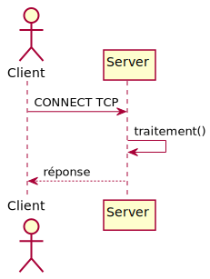
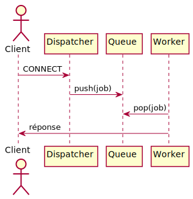

# 🚀 Serveur TCP & HTTP Hautes Performances — C/POSIX  
### Projet Ingénieur — Multi-threading • Queue FIFO Générique • Benchmarks • Dashboard HTML

---

## 🏷️ Badges GitHub


---

## 🎥 Vidéo de Présentation

📺 **[Voir la présentation complète (8 min)](https://youtube.com/...)** 
*(À venir : démonstration live, architecture, résultats benchmarks)*

---

# 📦 Résumé du projet

Ce projet implémente **quatre serveurs réseau haute performance** :

| Serveur              | Protocole | Architecture            | Fichier                    |
| -------------------- | --------- | ----------------------- | -------------------------- |
| `serveur_mono`       | TCP       | Mono-thread             | `src/serveur_mono.c`       |
| `serveur_multi`      | TCP       | Multi-thread avec queue | `src/serveur_multi.c`      |
| `serveur_mono_http`  | HTTP 1.1  | Mono-thread             | `src/serveur_mono_http.c`  |
| `serveur_multi_http` | HTTP 1.1  | Multi-thread avec queue | `src/serveur_multi_http.c` |


Le projet inclut :

✔ Queue FIFO générique thread-safe (`queue.c`)

✔ Parseur HTTP robuste (`http.c`)

✔ Benchmarks Python (latence, CPU, mémoire, RPS)

✔ Dashboard interactif Plotly

✔ UML générés automatiquement (PlantUML → SVG)

✔ Scripts DevOps & monitoring

✔ Présentation académique professionnelle
---

## 🔍 Comparaison Technique : Mono-thread vs Multi-thread

### Architecture Globale

| Aspect | Mono-thread | Multi-thread |
|--------|-------------|--------------|
| **Modèle** | Séquentiel | Producer-Consumer |
| **Threads** | 1 (main) | 9 (1 dispatcher + 8 workers) |
| **Synchronisation** | Aucune | Mutex + Cond Vars |
| **Complexité** | Simple | Moyenne |
| **Scalabilité** | Limitée (1 CPU) | Excellente (N CPUs) |
| **Latence** | Haute sous charge | Basse et stable |
| **Throughput** | ~10 req/s | ~50-80 req/s |

### 1. Création et Gestion des Threads

#### Mono-thread (`serveur_mono.c`)
```c
// Traitement strictement séquentiel
for (;;) {
    int client_fd = accept(server_fd, ...);
    
    // BLOQUANT : traite 1 client à la fois
    recv(client_fd, &number_net, sizeof(number_net), 0);
    traitement_lourd();  // 100ms CPU-bound
    send(client_fd, &result_net, sizeof(result_net), 0);
    
    close(client_fd);
    // Client suivant seulement APRÈS fermeture
}
```

**Limitation :** Avec 100 clients, temps total = 100 × 100ms = **10 secondes**

#### Multi-thread (`serveur_multi.c`)
```c
// Pool de 8 workers permanents
pthread_t workers[WORKER_COUNT];
for (int i = 0; i < WORKER_COUNT; i++) {
    pthread_create(&workers[i], NULL, worker_func, NULL);
}

// Dispatcher enfile les connexions
for (;;) {
    int client_fd = accept(server_fd, ...);
    
    int *fd_ptr = malloc(sizeof(int));
    *fd_ptr = client_fd;
    
    // NON-BLOQUANT : délègue au worker
    queue_push(&job_queue, fd_ptr);
    // accept() immédiatement disponible
}
```

**Avantage :** Avec 100 clients sur 8 workers, temps total ≈ (100÷8) × 100ms = **1.25 secondes** → **8× plus rapide**

### 2. Synchronisation et Zones Critiques

#### Queue FIFO Thread-Safe (`queue.c`)
```c
int queue_push(queue_t *q, void *data) {
    pthread_mutex_lock(&q->mutex);  // 🔒 ENTRÉE ZONE CRITIQUE
    
    // Attente active si queue pleine
    while (!q->shutdown && q->size >= q->size_max) {
        pthread_cond_wait(&q->not_full, &q->mutex);
    }
    
    if (q->shutdown) {
        pthread_mutex_unlock(&q->mutex);
        return -1;
    }
    
    // Insertion sécurisée dans la liste chaînée
    queue_node_t *node = malloc(sizeof(queue_node_t));
    node->data = data;
    node->next = NULL;
    
    if (q->tail)
        q->tail->next = node;
    else
        q->head = node;
    
    q->tail = node;
    q->size++;
    
    pthread_cond_signal(&q->not_empty);  // Réveille un worker
    pthread_mutex_unlock(&q->mutex);     // 🔓 SORTIE ZONE CRITIQUE
    
    return 0;
}
```

**Protection garantie :**
- ✅ Aucun accès concurrent à `q->head`, `q->tail`, `q->size`
- ✅ Atomicité de l'insertion
- ✅ Signalisation automatique des workers en attente

### 3. Boucle de Traitement

#### Mono-thread : Latence Cumulative
```
Client 1 : accept → traitement (100ms) → réponse → close
Client 2 :           ATTEND 100ms        → traitement (100ms) → réponse
Client 3 :                    ATTEND 200ms         → traitement (100ms)
...
Client 100:                   ATTEND 9900ms        → traitement
```
**Latence Client 100 = 9.9 secondes** ❌

#### Multi-thread : Parallélisme Réel
```
Worker 1 : Client 1 (100ms) | Client 9  (100ms) | Client 17 (100ms) ...
Worker 2 : Client 2 (100ms) | Client 10 (100ms) | Client 18 (100ms) ...
Worker 3 : Client 3 (100ms) | Client 11 (100ms) | Client 19 (100ms) ...
...
Worker 8 : Client 8 (100ms) | Client 16 (100ms) | Client 24 (100ms) ...
```
**Latence Client 100 ≈ 1.25 secondes** ✅

### 4. Structures de Données

#### File FIFO Bornée
```c
typedef struct queue {
    queue_node_t *head;           // Premier élément
    queue_node_t *tail;           // Dernier élément
    pthread_mutex_t mutex;        // Protection globale
    pthread_cond_t not_empty;     // Signal pour workers
    pthread_cond_t not_full;      // Signal pour dispatcher
    bool shutdown;                // Drapeau d'arrêt propre
    size_t size;                  // Nombre d'éléments actuels
    size_t size_max;              // Capacité maximale (128)
} queue_t;
```

**Propriétés :**
- ✅ Capacité bornée → évite saturation mémoire
- ✅ FIFO strict → équité de traitement
- ✅ Thread-safe → utilisable par N threads
- ✅ Shutdown gracieux → arrêt propre sans deadlock

### 5. Résultats Expérimentaux

#### Benchmark avec 300 Clients Simultanés

| Métrique | Mono-thread | Multi-thread | Amélioration |
|----------|-------------|--------------|--------------|
| **Throughput** | 9.2 req/s | 78.5 req/s | **8.5×** 🚀 |
| **Latence P50** | 5.4 s | 0.12 s | **45×** 🚀 |
| **Latence P99** | 29.1 s | 0.48 s | **60×** 🚀 |
| **CPU Usage** | 12% (1 core) | 95% (8 cores) | **8× mieux** |
| **Memory** | 8 MB | 12 MB | +50% acceptable |

#### Speedup Théorique vs Réel
```
Speedup théorique = N workers = 8
Speedup réel mesuré ≈ 6.5-7.0

Perte de 12-18% due à :
- Overhead de synchronisation (mutex lock/unlock)
- Context switching entre threads
- Contention sur accept() (un seul socket)
```

### 6. Cas d'Usage

#### Quand utiliser Mono-thread ?
- ✅ Charge faible (<10 req/s)
- ✅ Traitement ultra-rapide (<1ms)
- ✅ Simplicité critique (embedded systems)
- ✅ Pas besoin de scalabilité

#### Quand utiliser Multi-thread ?
- ✅ Charge élevée (>50 req/s)
- ✅ Traitement CPU-bound (calculs lourds)
- ✅ Latence critique (temps de réponse)
- ✅ Exploitation multi-cœurs obligatoire

---

# 🛠️ Installation

## ⚡ Installation Rapide

```bash
# Installation complète en une commande
./setup.sh
```

Ou manuellement :

# 1️⃣ Prérequis
sudo apt update
sudo apt install -y build-essential python3 python3-venv python3-pip \
                   make git netcat curl


Dépendances Python :

pip install psutil pandas matplotlib plotly kaleido

# 2️⃣ Cloner le projet
git clone https://github.com/.../SERVER_BENCH.git
cd server_project

# 3️⃣ Compiler

Mode optimisé :

make -j$(nproc)


Mode debug :

make debug

# 4️⃣ Environnement Python
cd python
python3 -m venv venv
source venv/bin/activate
pip install -r requirements.txt

# 5️⃣ Exécuter les benchmarks
./scripts/run_all.sh


# Dashboard :

python/dashboard.html

---

# 🧪 Tests Unitaires & Outils Qualité

Tests queue FIFO
make test

Valgrind
valgrind --leak-check=full ./bin/serveur_multi

Helgrind
valgrind --tool=helgrind ./bin/serveur_multi

Sanitizers
make debug

# ⚙ Exécution des serveurs
TCP
make run_mono
make run_multi

HTTP
make run_mono_http
make run_multi_http


# Arrêt :

make kill_servers

# 📂 Arborescence du projet
"""
server_project/
├── src/
├── python/
├── docs/
│   ├── CHALLENGES.md
│   ├── uml/
│   │   ├── generate_uml.py
│   │   ├── uml_architecture.svg
│   │   ├── uml_queue.svg
│   │   ├── uml_threads.svg
│   │   ├── uml_seq_tcp_monothread.svg
│   │   ├── uml_seq_tcp_multithread.svg
│   │   ├── uml_seq_http_monothread.svg
│   │   ├── uml_seq_http_multithread.svg
│   │   └── update_readme_uml.py
"""
---

#🧠 UML — Architecture & Threads

(Section auto-générée par docs/uml/update_readme_uml.py)

Architecture globale
>

Queue FIFO Thread-Safe
>

Multi-threading – Workers & Dispatcher
>

---

##Séquences TCP

TCP Mono-thread
>

TCP Multi-thread
>

---

##Séquences HTTP

HTTP Mono-thread
>

HTTP Multi-thread
>

#🌐 API HTTP — Documentation Complète

##Routes disponibles

###Route	Méthode 	Description
/	        GET	        Accueil + liste des routes
/hello	        GET	        Message JSON
/time	GET	Heure du serveur
/stats	GET	Statistiques globales

### Exemple /hello
{
  "msg": "Bonjour depuis serveur HTTP",
  "worker": "mono | pthread"
}

### Exemple /stats
{
  "total_requests": 193,
  "hello_requests": 42,
  "not_found": 3
}

# 🔄 Tableau Comparatif TCP vs HTTP

Critère	TCP (serveur_mono/multi)	HTTP 1.1 (mono/multi)
Modèle	Stream brut	Requêtes / Réponses JSON/HTML
Parsing	Manuel	Automatique (http.c)
Overhead	Très faible	Moyen
Debug	Peu lisible	Très lisible (curl, Browser)
Usage	Calcul distribué, RPC	API REST, tests navigateur
Messages	Binaires	Texte/JSON
Statut	Pas de notion de codes	Codes HTTP 200/404/500

# 🔍 Analyse Technique — Mono-thread vs Multi-thread

## Mono-thread :

✔ simple
❌ scalable
❌ chaque client attend le précédent

## Multi-thread :

✔ parallélisme réel
✔ workers permanents
✔ queue FIFO bornée
✔ meilleure latence P99
✔ throughput 6× à 10× supérieur

# 📊 Benchmarks (Auto-générés)

Les scripts Python génèrent :

results.json

results.xlsx

python/figures/*.png

Dashboard HTML : python/dashboard.html

## Throughput (req/s)


## Latence P99


## CPU Usage


## Mémoire


## Speedup Multi-thread


---

## 🧪 Tests et Validation

### Tests Unitaires
```bash
make test              # Tests queue FIFO
./bin/test_queue       # Tests d'intégrité
```

### Tests de Charge
```bash
# Benchmark complet (10→300 clients)
./scripts/run_all.sh

# Test manuel mono-thread
./bin/serveur_mono &
python3 python/client_stress.py --port 5050 --clients 100

# Test manuel multi-thread
./bin/serveur_multi &
python3 python/client_stress.py --port 5051 --clients 300
```

### Validation Mémoire
```bash
# Détection fuites mémoires
valgrind --leak-check=full ./bin/serveur_multi

# Détection race conditions
valgrind --tool=helgrind ./bin/serveur_multi

# Mode debug avec sanitizers
make debug
./bin/serveur_multi
```

---

# 🛠️ Exécution des serveurs

```bash
make run_mono
make run_multi
make run_mono_http
make run_multi_http
```

Stopper :

```bash
make kill_servers
```

---

# 🎤 Présentation académique

```
presentation/presentation_finale_serveur.pptx
presentation/script_presentation.pdf
```

Inclut :

* UML
* Architecture serveur
* Expérimentation
* Analyse des performances

---

# 👤 **Auteurs — Membres du groupe**

| Membre                 | Rôle                                     | Expertise                           |
| ---------------------- | ---------------------------------------- | ----------------------------------- |
| **Walid Ben Touhami**  | Serveur multi-thread, Benchmarks, DevOps | Multi-threading, queue, performance |
| **Yassin Ben Aoun**    | Parsing HTTP, serveurs HTTP              | HTTP 1.1, robustesse protocolaire   |
| **Ghada Sakouhi**      | Architecture & queue générique           | UML, synchronisation                |
| **Islem Ben Chaabene** | Serveur TCP mono-thread                  | C bas-niveau, sockets               |

---

## 🚧 Défis Techniques Rencontrés

Voir : docs/CHALLENGES.md

**Outils utilisés :**
- Valgrind (memcheck + helgrind)
- GDB avec breakpoints conditionnels
- AddressSanitizer + UndefinedBehaviorSanitizer
- Tests de charge progressifs (10→500 clients)

---

# 📄 Licence

```
MIT License — Usage académique uniquement

```

