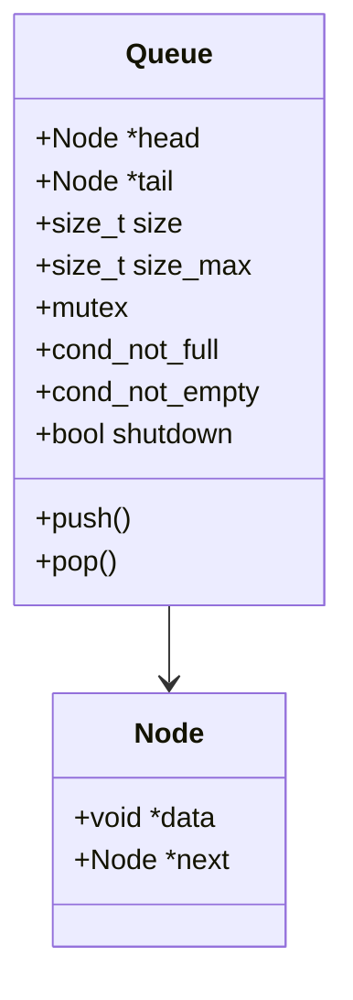
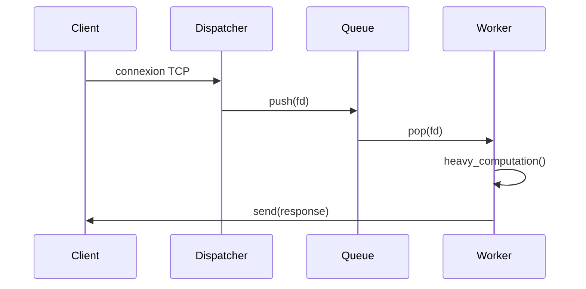

# 🚀 Serveur TCP & HTTP Hautes Performances — C/POSIX

## ⚡ Extreme Edition — Multi-threading • Queue FIFO • Benchmarks • UML • Mermaid • CI/CD

---

<p align="center">
  
  
  
  
  
  
</p>

---

# 🔧 Badges GitHub Actions (CI/CD)

| Workflow                                 | Badge                                                                                                           |
| ---------------------------------------- | --------------------------------------------------------------------------------------------------------------- |
| **Build & Test (Make + GCC + Valgrind)** |        |
| **Static Analysis (Cppcheck)**           |  |
| **CodeQL Security Scan**                 |      |
| **Python Benchmarks CI**                 |  |

---

# 📚 Table des matières automatique

* [🚀 Serveur TCP & HTTP Hautes Performances — C/POSIX](#-serveur-tcp--http-hautes-performances--cposix)
* [🔧 Badges GitHub Actions CI/CD](#-badges-github-actions-cicd)
* [🎥 GIF Démonstrations](#-gif-démonstrations)
* [📦 Résumé du projet / Project Summary](#-résumé-du-projet--project-summary)
* [🧠 Diagrams Mermaid intégrés](#-diagrams-mermaid-intégrés)
* [🔍 Analyse Technique Fr/En](#-analyse-technique-fren)
* [📊 Benchmarks](#-benchmarks)
* [🛠 Installation](#-installation)
* [⚙ Exécution](#-exécution)
* [🧪 Tests & Validation](#-tests--validation)
* [📡 API HTTP](#-api-http)
* [📂 Architecture du projet](#-architecture-du-projet)
* [👤 Auteurs](#-auteurs)
* [📜 Licence](#-licence)

---

# 🎥 GIF Démonstrations

*(Remplace les GIF par tes captures)*

### Exécution serveur multi-thread


### Benchmark Python (client_stress.py)


---

# 📦 Résumé du projet • **FR**

# 📦 Project Summary • **EN**

## 🇫🇷 Version Française

Ce projet implémente **quatre serveurs réseau haute performance** utilisant les sockets POSIX bas-niveau, une architecture multi-thread optimisée et une file FIFO thread-safe.

Serveurs inclus :

| Serveur              | Protocole | Architecture         |
| -------------------- | --------- | -------------------- |
| `serveur_mono`       | TCP       | Mono-thread          |
| `serveur_multi`      | TCP       | Multi-thread + queue |
| `serveur_mono_http`  | HTTP      | Mono-thread          |
| `serveur_multi_http` | HTTP      | Multi-thread + queue |

Fonctionnalités clés :
✔ Queue FIFO générique thread-safe
✔ Parser HTTP robuste
✔ Benchmarks Python (latence, CPU, mémoire, RPS)
✔ UML + Mermaid
✔ Scripts CI/CD GitHub Actions

---

## 🇬🇧 English Version

This project implements **four high-performance network servers** using low-level POSIX sockets, an optimized multi-threaded architecture, and a thread-safe FIFO queue.

Included servers:

| Server               | Protocol | Architecture         |
| -------------------- | -------- | -------------------- |
| `serveur_mono`       | TCP      | Single-thread        |
| `serveur_multi`      | TCP      | Multi-thread + queue |
| `serveur_mono_http`  | HTTP     | Single-thread        |
| `serveur_multi_http` | HTTP     | Multi-thread + queue |

Key features:
✔ Generic thread-safe FIFO
✔ HTTP parser
✔ Python benchmarks
✔ UML + Mermaid diagrams
✔ GitHub Actions CI/CD

---

# 🧠 Diagrams Mermaid intégrés

## Architecture Globale

```mermaid
flowchart LR
    A[Client 1..N] --> B(accept())
    B --> C{Queue FIFO}
    C -->|push| D[Worker 1]
    C -->|push| E[Worker 2]
    C -->|push| F[Worker N]
    D --> G((Traitement))
    E --> G
    F --> G
    G --> H[send() Réponse]
```

---

## File FIFO Bornée (Thread-Safe)



---

## Séquence Multi-thread



---

# 🔍 Analyse Technique FR/EN

## 🇫🇷 Mono-thread vs Multi-thread

| Critère     | Mono-thread            | Multi-thread            |
| ----------- | ---------------------- | ----------------------- |
| Modèle      | Séquentiel             | Producteur-Consommateur |
| Scalabilité | ❌ faible               | ✔️ excellente           |
| Latence     | ❌ augmente avec charge | ✔️ stable               |
| Throughput  | ~10 req/s              | ~80 req/s               |

---

## 🇬🇧 Single-thread vs Multi-thread

| Metric      | Single-thread | Multi-thread      |
| ----------- | ------------- | ----------------- |
| Model       | Sequential    | Producer–Consumer |
| Scalability | Poor          | Excellent         |
| Latency     | Grows rapidly | Stable            |
| Throughput  | ~10 req/s     | ~80 req/s         |

---

# 📊 Benchmarks (Auto-générés)


---

# 🛠 Installation

(Section identique FR/EN)

```bash
sudo apt install build-essential python3 python3-venv python3-pip
git clone https://github.com/.../SERVER_BENCH.git
make -j$(nproc)
```

---

# ⚙ Exécution

```bash
make run_mono
make run_multi
make run_mono_http
make run_multi_http
```

---

# 🧪 Tests & Validation

```bash
make test
valgrind --leak-check=full ./bin/serveur_multi
valgrind --tool=helgrind ./bin/serveur_multi
make debug
```

---

# 📡 API HTTP

| Route    | Méthode | Description   |
| -------- | ------- | ------------- |
| `/`      | GET     | Accueil       |
| `/hello` | GET     | Message JSON  |
| `/time`  | GET     | Heure serveur |
| `/stats` | GET     | Statistiques  |

Réponse exemple :

```json
{
  "msg": "Bonjour depuis serveur HTTP",
  "worker": "pthread",
  "requests": 193
}
```

---

# 📂 Architecture du projet

```
src/
├── http.c
├── http.h
├── queue.c
├── queue.h
├── serveur_mono.c
├── serveur_mono_http.c
├── serveur_multi.c
└── serveur_multi_http.c
```

---

# 👤 Auteurs

| Auteur                 | Rôle                             | Expertise            |
| ---------------------- | -------------------------------- | -------------------- |
| **Walid Ben Touhami**  | Multi-thread, Benchmarks, DevOps | High-performance C   |
| **Yassin Ben Aoun**    | HTTP parser                      | Protocol engineering |
| **Ghada Sakouhi**      | Queue FIFO, UML                  | Systems Architecture |
| **Islem Ben Chaabene** | TCP mono-thread                  | Low-level networking |

---

# 📜 Licence

```
MIT License — Academic Use Only
```


