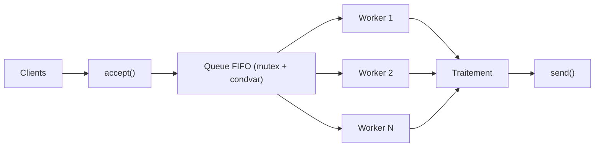
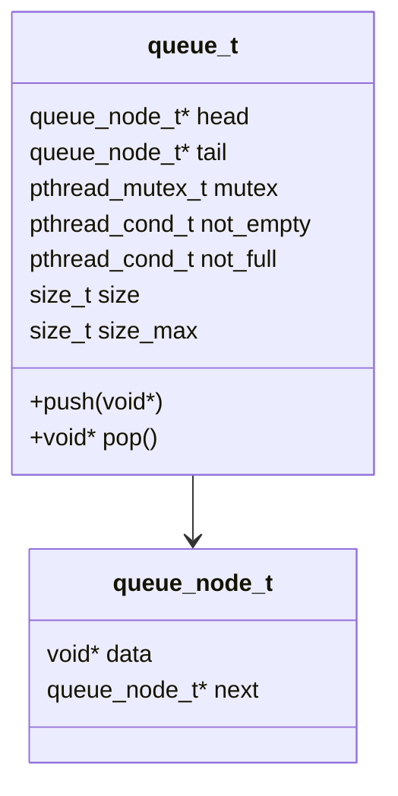

# 🚀 Serveur TCP & HTTP Hautes Performances — C/POSIX

## ⚡ Extreme Edition — Multi-threading • Queue FIFO • Benchmarks • UML • Mermaid • CI/CD

---

<p align="center">
  
  
  
  
  
</p>

---

# 🔧 **Badges GitHub Actions CI/CD (Advanced)**

| Workflow                                 | Badge                                                                                                                                         |
| ---------------------------------------- | --------------------------------------------------------------------------------------------------------------------------------------------- |
| **Build & Test (GCC + Make + Valgrind)** |        |
| **Static Analysis (Cppcheck)**           |  |
| **CodeQL Security Scan**                 |      |
| **Python Benchmarks CI**                 |   |

---

# 📚 Table des matières automatique

* [🎥 GIF Démonstrations](#-gif-démonstrations)
* [📦 Projet — Version FR/EN](#-projet--version-fren)
* [🧠 Diagrams Mermaid intégrés](#-diagrams-mermaid-intégrés)
* [📊 Benchmarks](#-benchmarks)
* [🛠 Installation](#-installation)
* [⚙ Exécution](#-exécution)
* [🧪 Tests & Validation](#-tests--validation)
* [📡 API HTTP](#-api-http)
* [📂 Architecture du projet](#-architecture-du-projet)
* [🚀 Pipeline DevOps complet](#-pipeline-devops-complet)
* [🔧 Intégration CI/CD — Workflows GitHub](#-intégration-cicd--workflows-github)
* [👤 Auteurs](#-auteurs)
* [📜 Licence](#-licence)

---

# 🎥 GIF Démonstrations

### Multi-thread server execution


### Benchmark execution


---

# 📦 **Projet — Version FR/EN**

## 🇫🇷 Version Française

Ce projet implémente **4 serveurs réseau haute performance** :

| Serveur            | Protocole | Architecture        |
| ------------------ | --------- | ------------------- |
| serveur_mono       | TCP       | mono-thread         |
| serveur_multi      | TCP       | multi-thread + FIFO |
| serveur_mono_http  | HTTP 1.1  | mono-thread         |
| serveur_multi_http | HTTP 1.1  | multi-thread + FIFO |

Fonctionnalités clés :

✔ Queue FIFO thread-safe
✔ Multi-thread performant (workers + dispatcher)
✔ HTTP parser minimaliste robuste
✔ Benchmarks Python avancés
✔ Dashboard interactif Plotly
✔ UML + Diagrammes Mermaid
✔ CI/CD complet GitHub Actions

---

## 🇬🇧 English Summary

This project provides **4 high-performance network servers** based on:

✔ POSIX sockets
✔ Multi-thread worker pool
✔ Thread-safe FIFO queue
✔ Minimal HTTP 1.1 parser
✔ Full benchmarking suite
✔ Automated DevOps pipeline & CI/CD

---

# 🧠 Diagrams Mermaid intégrés

## 1) Architecture Globale



---

## 2) Queue FIFO Thread-Safe



---

# 📊 Benchmarks

Auto-générés par les scripts Python :


---

# 🛠 Installation

```bash
sudo apt install build-essential python3 python3-venv python3-pip
git clone https://github.com/WalidBenTouhami/server_project.git
cd server_project
make -j$(nproc)
```

---

# ⚙ Exécution

```bash
make run_mono
make run_multi
make run_mono_http
make run_multi_http
```

---

# 🧪 Tests & Validation

```bash
make test
valgrind --leak-check=full ./bin/serveur_multi
valgrind --tool=helgrind ./bin/serveur_multi
make debug
```

---

# 📡 API HTTP

| Route    | Description   |
| -------- | ------------- |
| `/`      | Accueil       |
| `/hello` | JSON          |
| `/time`  | Horodatage    |
| `/stats` | Stats workers |

---

# 📂 Architecture du projet

```
src/
├── http.c / http.h
├── queue.c / queue.h
├── serveur_mono.c
├── serveur_multi.c
├── serveur_mono_http.c
└── serveur_multi_http.c
```

---

# 🚀 Pipeline DevOps complet

Pipeline interactif :

```bash
./scripts/run_interactive.sh
```

Il réalise automatiquement :

✔ Génération HTTP
✔ Compilation optimisée O3 + LTO
✔ UML Mermaid + PlantUML
✔ PPTX + PDF + Reveal.js
✔ Stress-tests
✔ Benchmarks extrêmes
✔ Monitoring CPU/mémoire
✔ CI/CD GitHub Actions
✔ Kill multi-services propre

---

# 🔧 Intégration CI/CD — Workflows GitHub

Les workflows sont fournis dans :

```
.github/workflows/
├── build.yml
├── cppcheck.yml
├── codeql.yml
└── benchmarks.yml
```

Pour installer automatiquement :

```bash
python3 install_ci_cd.py
```

---

# 👤 Auteurs

| Auteur             | Rôle                    | Expertise                |
| ------------------ | ----------------------- | ------------------------ |
| Walid Ben Touhami  | DevOps, Multi-threading | High-performance systems |
| Yassin Ben Aoun    | HTTP parsing            | Network protocols        |
| Ghada Sakouhi      | FIFO Queue, UML         | Software architecture    |
| Islem Ben Chaabene | TCP mono-thread         | Systems programming      |

---

# 📜 Licence

```
MIT License — Academic Use Only
```

---


