# 🚀 Serveur TCP & HTTP Hautes Performances — C/POSIX

## ⚡ Extreme Edition — Multi-threading • Queue FIFO • Benchmarks • UML • Mermaid • CI/CD

---

<p align="center">
  
  
  
  
  
  
</p>

---

# 📚 Table des matières automatique

* [🚀 Serveur TCP & HTTP Hautes Performances — C/POSIX](#-serveur-tcp--http-hautes-performances--cposix)
* [🔧 Badges GitHub Actions CI/CD](#-badges-github-actions-cicd)
* [🎥 GIF Démonstrations](#-gif-démonstrations)
* [📦 Résumé du projet / Project Summary](#-résumé-du-projet--project-summary)
* [🧠 Diagrams Mermaid intégrés](#-diagrams-mermaid-intégrés)
* [🔍 Analyse Technique Fr/En](#-analyse-technique-fren)
* [📊 Benchmarks](#-benchmarks)
* [🛠 Installation](#-installation)
* [⚙ Exécution](#-exécution)
* [🧪 Tests & Validation](#-tests--validation)
* [📡 API HTTP](#-api-http)
* [📂 Architecture du projet](#-architecture-du-projet)
* [👤 Auteurs](#-auteurs)
* [📜 Licence](#-licence)

---

# 🎥 GIF Démonstrations

*(Remplace les GIF par tes captures)*

### Exécution serveur multi-thread


### Benchmark Python (client_stress.py)


---

# 📦 Résumé du projet • **FR**

# 📦 Project Summary • **EN**

## 🇫🇷 Version Française

Ce projet implémente **quatre serveurs réseau haute performance** utilisant les sockets POSIX bas-niveau, une architecture multi-thread optimisée et une file FIFO thread-safe.

Serveurs inclus :

| Serveur              | Protocole | Architecture         |
| -------------------- | --------- | -------------------- |
| `serveur_mono`       | TCP       | Mono-thread          |
| `serveur_multi`      | TCP       | Multi-thread + queue |
| `serveur_mono_http`  | HTTP      | Mono-thread          |
| `serveur_multi_http` | HTTP      | Multi-thread + queue |

Fonctionnalités clés :
✔ Queue FIFO générique thread-safe
✔ Parser HTTP robuste
✔ Benchmarks Python (latence, CPU, mémoire, RPS)
✔ UML + Mermaid
✔ Scripts CI/CD GitHub Actions

---

## 🇬🇧 English Version

This project implements **four high-performance network servers** using low-level POSIX sockets, an optimized multi-threaded architecture, and a thread-safe FIFO queue.

Included servers:

| Server               | Protocol | Architecture         |
| -------------------- | -------- | -------------------- |
| `serveur_mono`       | TCP      | Single-thread        |
| `serveur_multi`      | TCP      | Multi-thread + queue |
| `serveur_mono_http`  | HTTP     | Single-thread        |
| `serveur_multi_http` | HTTP     | Multi-thread + queue |

Key features:
✔ Generic thread-safe FIFO
✔ HTTP parser
✔ Python benchmarks
✔ UML + Mermaid diagrams
✔ GitHub Actions CI/CD

---

# 🧠 Diagrams Mermaid intégrés

## Architecture Globale

```mermaid
flowchart LR
    classDef client fill:#0af,color:#fff,stroke:#036,stroke-width: 2px;
    classDef accept fill:#09f,color:#fff,stroke:#036,stroke-width:2px;
    classDef queue fill:#f90,color:#000,stroke:#630,stroke-width:2px;
    classDef worker fill:#6c0,color:#fff,stroke:#030,stroke-width:2px;
    classDef treat fill:#c0c,color:#fff,stroke:#505,stroke-width:2px;
    classDef resp fill:#555,color:#fff,stroke:#222,stroke-width:2px;

    A["Clients 1..  N"]:::client --> B["accept()"]:::accept
    B --> C["Queue FIFO\n(Mutex + CondVar)"]:::queue

    C --> D["Worker 1"]:::worker
    C --> E["Worker 2"]:::worker
    C --> F["Worker N"]::: worker

    D --> G["Traitement\nCPU-bound"]:::treat
    E --> G
    F --> G

    G --> H["send()\nRéponse"]:::resp
```

---

# 🧩 1) **Architecture Globale — Multi-thread avec Queue FIFO**

```mermaid
flowchart LR
    classDef client fill:#0af,color:#fff,stroke:#036,stroke-width:2px;
    classDef accept fill:#09f,color:#fff,stroke:#036,stroke-width:2px;
    classDef queue fill:#f90,color:#000,stroke:#630,stroke-width:2px;
    classDef worker fill:#6c0,color:#fff,stroke:#030,stroke-width:2px;
    classDef treat fill:#c0c,color:#fff,stroke:#505,stroke-width:2px;
    classDef resp fill:#555,color:#fff,stroke:#222,stroke-width:2px;

    A["Clients 1..  N"]:::client --> B["accept()"]:::accept
    B --> C["Queue FIFO<br/>(Mutex + CondVar)"]:::queue

    C --> D["Worker 1"]:::worker
    C --> E["Worker 2"]:::worker
    C --> F["Worker N"]:::worker

    D --> G("Traitement<br/>CPU-bound"):::treat
    E --> G
    F --> G

    G --> H["send()<br/>Réponse"]:::resp
```



---

# 🧩 2) **Architecture de la Queue FIFO (Thread-Safe)**


---

# 🧵 3) **Threading Model — Dispatcher & Worker Threads**

```mermaid
sequenceDiagram
    participant Client
    participant Dispatcher
    participant Queue
    participant Worker1
    participant Worker2

    Client->>Dispatcher: accept()
    Dispatcher->>Queue: push(fd)

    alt Queue non vide
        Queue->>Worker1: pop(fd)
    else Saturation
        Dispatcher->>Queue: wait(not_full)
    end

    Worker1->>Worker1: traitement_lourd()
    Worker1->>Client: send() réponse
```



---

# 🔁 4) **Séquence TCP — Mono-thread**


---

# 🔁 5) **Séquence TCP — Multi-thread + Queue**


---

# 🌐 6) **Séquence HTTP — Mono-thread**


---

# 🌐 7) **Séquence HTTP — Multi-thread**


---

# 🧠 8) **Comparaison Synthétique — Mono vs Multi-thread**

```mermaid
flowchart TB
    classDef mono fill:#f99,color:#fff,stroke:#c00,stroke-width:2px;
    classDef multi fill:#9f9,color:#000,stroke:#060,stroke-width:2px;
    classDef arrow fill:#fff,color:#000,stroke:#ccc;

    A["Mono-thread"]:::mono --> B["1 seul thread<br/>Séquentiel"]
    A --> C["accept() bloquant"]
    A --> D["Latence cumulée"]

    E["Multi-thread"]:::multi --> F["Pool de Workers"]
    E --> G["Queue FIFO"]
    E --> H["Parallélisme réel"]
    E --> I["Throughput élevé"]

    B -.->|évolution| E
```



---

# 🗂️ **File FIFO Bornée (Thread-Safe)**


---

# 🔄 **Séquence Multi-thread — Complète**


---

# 🔍 Analyse Technique FR/EN

## 🇫🇷 Mono-thread vs Multi-thread

| Critère     | Mono-thread            | Multi-thread            |
| ----------- | ---------------------- | ----------------------- |
| Modèle      | Séquentiel             | Producteur-Consommateur |
| Scalabilité | ❌ faible               | ✔️ excellente           |
| Latence     | ❌ augmente avec charge | ✔️ stable               |
| Throughput  | ~10 req/s              | ~80 req/s               |

---

## 🇬🇧 Single-thread vs Multi-thread

| Metric      | Single-thread | Multi-thread      |
| ----------- | ------------- | ----------------- |
| Model       | Sequential    | Producer–Consumer |
| Scalability | Poor          | Excellent         |
| Latency     | Grows rapidly | Stable            |
| Throughput  | ~10 req/s     | ~80 req/s         |

---

# 📊 Benchmarks (Auto-générés)


---

# 🛠 Installation

```bash
sudo apt install build-essential python3 python3-venv python3-pip
git clone https://github.com/.../SERVER_BENCH.git
make -j$(nproc)
```

---

# ⚙ Exécution

```bash
make run_mono
make run_multi
make run_mono_http
make run_multi_http
```

---

# 🧪 Tests & Validation

```bash
make test
valgrind --leak-check=full ./bin/serveur_multi
valgrind --tool=helgrind ./bin/serveur_multi
make debug
```

---

# 📡 API HTTP

| Route    | Méthode | Description   |
| -------- | ------- | ------------- |
| `/`      | GET     | Accueil       |
| `/hello` | GET     | Message JSON  |
| `/time`  | GET     | Heure serveur |
| `/stats` | GET     | Statistiques  |

Réponse exemple :

```json
{
  "msg": "Bonjour depuis serveur HTTP",
  "worker": "pthread",
  "requests": 193
}
```

---

# 📂 Architecture du projet

```
src/
├── http.c
├── http.h
├── queue.c
├── queue.h
├── serveur_mono.c
├── serveur_mono_http.c
├── serveur_multi.c
└── serveur_multi_http.c
```

---

# 👤 Auteurs

| Auteur                 | Rôle                             | Expertise            |
| ---------------------- | -------------------------------- | -------------------- |
| **Walid Ben Touhami**  | Multi-thread, Benchmarks, DevOps | High-performance C   |
| **Yassin Ben Aoun**    | HTTP parser                      | Protocol engineering |
| **Ghada Sakouhi**      | Queue FIFO, UML                  | Systems Architecture |
| **Islem Ben Chaabene** | TCP mono-thread                  | Low-level networking |

---

# 📜 Licence

```
MIT License — Academic Use Only
```


